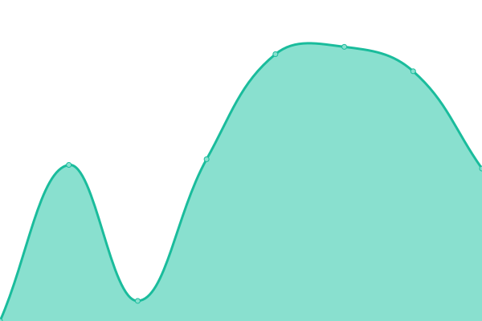
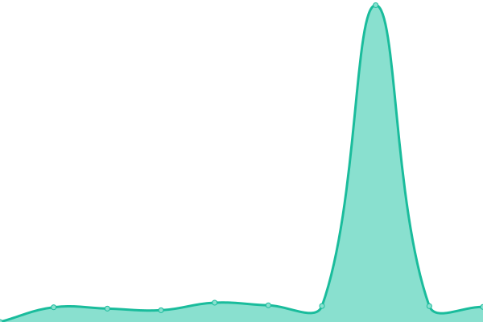

# [📈 Live Status](https://uptime.sisedu.org): <!--live status--> **🟩 All systems operational**

This repository contains the open-source uptime monitor and status page for [SequoiaTech](https://uptime.sisedu.org), powered by [Upptime](https://github.com/upptime/upptime).

With [Upptime](https://upptime.js.org), you can get your own unlimited and free uptime monitor and status page, powered entirely by a GitHub repository. We use [Issues](https://github.com/SequoiaTech/uptime/issues) as incident reports, [Actions](https://github.com/SequoiaTech/uptime/actions) as uptime monitors, and [Pages](https://uptime.sisedu.org) for the status page.

<!--start: status pages-->
<!-- This summary is generated by Upptime (https://github.com/upptime/upptime) -->
<!-- Do not edit this manually, your changes will be overwritten -->
<!-- prettier-ignore -->
| URL | Status | History | Response Time | Uptime |
| --- | ------ | ------- | ------------- | ------ |
|  [Sisedu](https://www.sisedu.org) | 🟩 Up | [sisedu.yml](https://github.com/SequoiaTech/uptime/commits/HEAD/history/sisedu.yml) | 

 1344ms
     
 | 

<a href="https://uptime.sisedu.org/history/sisedu">100.00%</a>
    

|  [Coolify](https://coolify.sisedu.org) | 🟩 Up | [coolify.yml](https://github.com/SequoiaTech/uptime/commits/HEAD/history/coolify.yml) | 

 1434ms
     
 | 

<a href="https://uptime.sisedu.org/history/coolify">70.50%</a>
    

|  [Proxmox](https://proxmox.sisedu.org) | 🟩 Up | [proxmox.yml](https://github.com/SequoiaTech/uptime/commits/HEAD/history/proxmox.yml) | 

 1055ms
     
 | 

<a href="https://uptime.sisedu.org/history/proxmox">100.00%</a>
    

|  [Concert Sisedu](https://concert.sisedu.org) | 🟩 Up | [concert-sisedu.yml](https://github.com/SequoiaTech/uptime/commits/HEAD/history/concert-sisedu.yml) | 

 7077ms
     
 | 

<a href="https://uptime.sisedu.org/history/concert-sisedu">70.51%</a>
    

|  [Sisedu API](https://api.sisedu.org) | 🟩 Up | [sisedu-api.yml](https://github.com/SequoiaTech/uptime/commits/HEAD/history/sisedu-api.yml) | 

 777ms
     
 | 

<a href="https://uptime.sisedu.org/history/sisedu-api">70.51%</a>
    

|  [IGCSE Site](https://igcse.sisedu.org) | 🟩 Up | [igcse-site.yml](https://github.com/SequoiaTech/uptime/commits/HEAD/history/igcse-site.yml) | 

 6998ms
     
 | 

<a href="https://uptime.sisedu.org/history/igcse-site">70.52%</a>
    

|  [Exhibition Site](https://exhibition.sisedu.org) | 🟩 Up | [exhibition-site.yml](https://github.com/SequoiaTech/uptime/commits/HEAD/history/exhibition-site.yml) | 

 7143ms
     
 | 

<a href="https://uptime.sisedu.org/history/exhibition-site">70.53%</a>
    

|  [Supabase API](https://supabase.sisedu.org/api/pg-meta/default/query?key=table-rows-301276) | 🟩 Up | [supabase-api.yml](https://github.com/SequoiaTech/uptime/commits/HEAD/history/supabase-api.yml) | 

 686ms
     
 | 

<a href="https://uptime.sisedu.org/history/supabase-api">100.00%</a>
    

<!--end: status pages-->

[**Visit our status website →**](https://uptime.sisedu.org)

## 📄 License

- Powered by: [Upptime](https://github.com/upptime/upptime)
- Code: [MIT](./LICENSE) © [Anand Chowdhary](https://anandchowdhary.com), supported by [Pabio](https://pabio.com)
- Data in the `./history` directory: [Open Database License](https://opendatacommons.org/licenses/odbl/1-0/)
